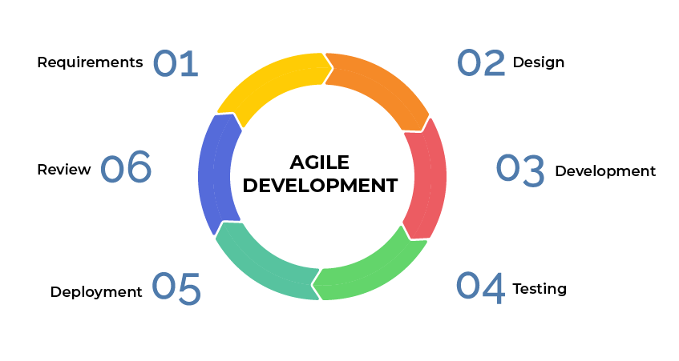

# Σημειώσεις

## Ερώτημα 1

### Μοντέλο build and fix

Το **μοντέλο build and fix** είναι ένα μοντέλο στο οποίο το λογισμικό έχει αναπτυχθεί χωρίς σχεδιασμό. Ουσιαστικά, κατασκευάζεται ένα αρχικό προϊόν και τροποποιείτε μέχρι να ικανοποιήσει τον χρήστη.

Το μοντέλο έχει δύο φάσεις

* Η φάση του **build**: Όπου ο κώδικας κατασκευάζεται και περνάει στην επόμενη φάση.
* Η φάση του **fix**: Όπου ο κώδικας έχει φτάσει σε bug και error free στάδιο και μπορεί να παρουσιαστεί στον χρήστη και να τροποποιηθεί κατάλληλα για να ικανοποιήσει τον τελικό χρήστη. 

| Πλεονεκτήματα | Μειονεκτήματα |
| ------------- | ------------- |
| Χρειάζεται λιγότερη εμπειρία σε οποιονδήποτε άλλο τομέα εκτός του προγραμματισμού | Δεν υπάρχει ένας μετρητής στον οποίο κρίνετε ούτε η πρόοδος, ούτε η ποιότητα του προϊόντος και ούτε ο ρίσκο |
| Πολύ ταιριαστό με μικρά λογισμικά | Ο κόστος είναι πελώριος επειδή χρειάζεται να γίνονται πάρα πολλές στο λογισμικό μέχρι να ικανοποιήσει τον τελικό χρήστη. |
| Χρειάζεται λιγότερο πλάνο | Είναι πολύ ανεπίσημος τρόπος σχεδίασης ενός λογισμικού |
| | Η συντήρηση τέτοιων μοντέλων είναι δύσκολη | 

### Μοντέλο καταρράκτη

Το **μοντέλο του καταρράκτη (waterfall model)** είναι ένα από τα πιο κλασσικά παραδείγματα του life cycle. Η ανάπτυξη του λογισμικού είναι γραμμική και πάει από βήμα σε βήμα, η οποία πηγαίνει από βήμα σε βήμα με την ίδια ακριβώς δουλεία, χωρίς να υπάρχει δυνατότητα να μπορεί να γυρίσει πίσω. Κάθε βήμα έχει ξεχωριστό στόχο.

| Είσοδος στο βήμα | Βήμα | Έξοδος του Βήματος |
| ---------------- | ---- | ------------------ |
| Οι απαιτήσεις του λογισμικού πραγματοποιείται μέσω επικοινωνίας | Ανάλυσης | Οι προδιαγραφές του λογισμικού είναι ορισμένες |
| Οι προδιαγραφές του λογισμικού είναι ορισμένες | Σχεδίασης | Σχεδιασμός του εγγράφου προδιαγραφών |
| Σχεδιασμός του εγγράφου προδιαγραφών | Ανάπτυξη | Δημιουργία εκτέλεσης προϊόντος |
| Δημιουργία εκτέλεσης προϊόντος | Δοκιμή | Έτοιμο προϊόν |
| Έτοιμο προϊόν | Υλοποίηση | Παραδοτέο λογισμικό |
| Παραδοτέο | Συντήρησης | Αλλαγές στις προδιαγραφές |

| Πλεονεκτήματα | Μειονεκτήματα |
| ------------- | ------------- |
| Αρκετά απλό στην κατανόηση | Χρειάζεται να είναι οι προδιαγραφές έτοιμες πριν ξεκινήσει η ανάπτυξη |
| Κάθε βήμα της ανάπτυξης συνεχίζει διαδοχικά | Δεν μπορούν να γίνουν αλλαγές στις προδιαγραφές σε μεταγενέστερα βήματα του μοντέλου. Αυτό σημαίνει ότι ένα λογισμικό μπορεί να μπει στο στάδιο της δοκιμής θα είναι πολύ δύσκολο να γίνουν οι απαραίτητες αλλαγές |
| Επιτρέπει ελέγχο στην δημιουργία ενός προγράμματος με προθεσμίες σε κάθε βήμα | Δεν υπάρχει καμία επικοινωνία με τον τελικό χρηστή όσο το λογισμικό αναπτύσσετε |
| Βοηθάει στον έλεγχο των χρονοπρογράμματων, των προϋπολογισμών  και του εγγράφου | Δεν παίρνει υπόψιν του τον ρίσκο της διοίκησης |
| | Θεωρεί ότι οι προδιαγραφές είναι σταθερές και δεν αλλάζουν κατά την διάρκεια του κύκλου ζωής |

### Παράλληλο μοντέλο

????

### Εξελικτικές (Ταχείας Ανάπτυξης) Μεθοδολογίες

Το **μοντέλο εξελικτικής ή ταχείας ανάπτυξης (Rapid Application Development, RAD)** είναι ένα μοντέλο το οποίο στηρίζετε στο να σπάει το μεγάλο πρότζεκτ σε μικρότερα πρότζεκτ και να δημιουργεί διάφορα πρωτότυπα ώστε να μπορούν να διακριθούν τα προβλήματα που υπάρχουν και να διορθωθούν. Ένα μεγάλο χαρακτηριστικό των RAD μοντέλων είναι ότι γίνετε επαναχρησιμοποίηση του ίδιου κώδικα, διεργασιών, templates και εργαλείων.
Οι φάσεις του RAD είναι οι εξής:

* **Σχεδιασμού**
* **Ανάλυσης**
* **Πρωτοτύπων**
* **Επανάληψη των βημάτων της ανάλυσης και των πρωτοτύπων όπου χρειάζεται**
* **Ολοκλήρωση των πρωτοτύπων**
* **Υλοποίηση**

| Πλεονεκτήματα | Μειονεκτήματα |
| ------------- | ------------- |
| Για τα παραδοτέα είναι πολύ εύκολο στο να μπορούν να μεταφερθούν σε πιο υψηλού επίπεδου αφηρημένου κώδικα | Είναι χρήσιμο μόνο για μεγάλα προτζεκτ |
| Παρέχει πολύ μεγάλη ευελιξία στον επανασχεδιασμό σε περίπτωση όποτε θεωρείτε απαραίτητο | Τα RAD πρότζεκτ αποτυγχάνουν όταν δεν υπάρχει η απαραίτητη δέσμευση από τους developers ή τους χρήστες όταν το λογισμικό τελειώσει στην ώρα του. |
| Μείωση της ανάγκης εγγραφής νέου κώδικα λόγο της χρήσης γεννήτριας κώδικα και επαναχρησιμοποίηση ήδη υπάρχων κώδικα | Δεν είναι αποδεκτό σε περίπτωση μεγάλου κινδύνου τεχνικών προβλημάτων |
| Ενθαρρύνει τους χρήστες στο να συμμετέχουν στην ανάπτυξη του προτζεκτ | Τα ενδιαφέροντα των χρηστών και των developers τείνουν στο να διαφέρουν με αποτέλεσμα να μην μπορούν να πραγματοποιηθούν οι απαιτήσεις του προτζεκτ με την χρήση του RAD μοντέλου |
| Πιθανότητα να υπάρχουν λιγότερα ελαττωματικά προϊόντα λόγω των πρωτότυπων ||

### Εύκαμπτες/ευέλικτες μεθοδολογίες ανάπτυξης (Agile methodologies)

Οι **εύκαμπτες μεθοδολογίες ανάπτυξης (Agile methodologies)** έχουν την ικανότητα να μπορούν να δημιουργούν και να αλληλεπιδρούν με την αλλαγή. Η διαφορά του Agile με άλλες μεθοδολογίες είναι ότι εστιάζει στους ανθρώπους της ομάδας και πως δουλεύουν μεταξύ τους. Οι λύσεις αναπτύσσονται μέσω συνεργασίας μεταξύ της αυτοδιοικούμενη ομάδα χρησιμοποιώντας πρακτικές για το context που βολεύει την κάθε ομάδα. Αυτό σημαίνει ότι δεν υπάρχουν διοικητές (managers) στην ομάδα, αλλά κάθε ομάδα έχει την ικανότητα να μπορεί να οργανωθεί μόνη της. Τα μέλη αυτής της ομάδας είναι ίσα και δεν έχουν συγκεκριμένους ρόλους μέσα στην ομάδα. 
To Agile, σύμφωνα με το [Agile Manifesto](https://www.agilealliance.org/agile101/12-principles-behind-the-agile-manifesto/) έχει 12 βασικά θεμελιώδες ιδεολογίες:

1. Η μεγαλύτερη προτεραιότητα είναι να ικανοποιηθεί ο πελάτης νωρίς και να υπάρχει συνέχει παράδοση καλού λογισμικού
2. Να υπάρχουν αλλαγές στις προδιαγραφές μέχρι και όταν είναι αργά στο στάδιο της ανάπτυξης
3. Να παραδίδετε ένα λειτουργικό λογισμικό συχνά, σε οποιονδήποτε χρονικό πεδίο
4. Οι επιχειρηματίες και οι developers πρέπει να δουλεύουν μαζί καθημερινά κατά την διάρκεια όλου του project
5. Να κτίζονται projects γύρο από άτομα που έχουν ισχυρό κίνητρο
6. Η πιο αποτελεσματική μέθοδος στο να μπορεί να μεταφερθεί πληροφορία από και μέσω της developing ομάδας πρόσωπο προς πρόσωπο
7. Ένα λειτουργικό λογισμικό είναι ο κύριος μετρητής της προόδου
8. Οι διεργασίες της Agile προωθούν στο να μπορεί να υπάρξει ένα σταθερό development περιβάλλον από σπόνσορες, developers και χρήστες που θα μπορούν να συντηρήσουν μία σταθερή πρόοδο για μεγάλο χρονικό διάστημα
9. Συνεχές προσοχή σε τεχνική τελειότητα και η καλή σχεδίαση βελτιώνει την Agile μεθοδολογία
10. Η απλότητα και η τέχνη του περιορίζεται το μέγεθος της δουλείας που δεν γίνετε είναι ουσιώδες χαρακτηριστικό του Agile
11. Οι καλύτερες αρχιτεκτονικές, προδιαγραφές και σχεδιάσεις έρχονται από αυτοδιοικούμενες ομάδες
12. Σε συχνές συναντήσεις, η ομάδα ψάχνει πως μπορεί να γίνει όλο και πιο αποτελεσματική, κοιτάει τα λάθη της και συνεχίζει

### Scrum

To **Scrum** είναι ένα framework το οποίο βοηθάει τους ανθρώπους, τις ομάδες και τους οργανισμούς να δημιουργήσουν άξιες ευέλικτες λύσεις σε περίπλοκα προβλήματα. Το Scrum χρειάζεται έναν Scrum Master να καλλιεργεί το περιβάλλον όπου:

1. Ένας πελάτης ζητάει δουλεία για την λύση του προβλήματος του σε ένα product backlog
2. Η Scrum ομάδα επιλέγει ένα τμήμα της δουλείας που πρέπει να κάνει αναλόγως με την αξία της δουλείας σε ένα Spring
3.  
4. Επανάληψη της διαδικασίας

### Το μοντέλο της σπείρας

Το **μοντέλο της σπείρας (spiral model)** είναι μία παραλλαγή του μοντέλου του καταρράκτη όπου έχει υπερβολικά πολλά στάδια.

| Πλεονεκτήματα | Μειονεκτήματα |
| ------------- | ------------- |
| Παρέχει ένα εργατικό μοντέλο στον χρήστη νωρίς στην διεργασία και επιτρέπει μία πρόωρη εκτίμηση και αυξάνει την αυτοπεποίθηση του χρήστη | Άμα ο χρήστης δεν είναι ικανοποιημένος με το τελικό πρωτότυπο, τότε ένα νέο πρωτότυπο κατασκευάζεται. Έτσι επιτρέπει να δημιουργηθεί το τέλειο πρωτότυπο |
| Ο developer αποκτάει εμπειρίες και γνώση από την δημιουργία του πρωτότυπου και έτσι καταφέρνει να δημιουργήσει καλύτερες προδιαγραφές για την υλοποίηση | Ο developer χάνει το σωστό επίκεντρο του πρωτότυπου και έτσι χάνετε η ποιότητα της εφαρμογής |
| Το μοντέλο του πρωτότυπου πρέπει να εξυπηρετεί τις ανάγκες των προδιαγραφών οι οποίες δεν είναι καθαρές και έτσι μειώνει την ασάφεια και βελτιώνει την επικοινωνία μεταξύ των developers και των χρηστών | Τα πρωτότυπα μπορούν να οδηγήσουν σε λανθασμένες προσδοκίες |
| Βοηθάει στην μείωση των ρίσκων τα οποία συνδέονται με το λογισμικό | Ο κύριος στόχος είναι να γίνονται γρήγορα η ανάπτυξη και έτσι το παρακάτω μοντέλο είναι αρκετά αργό |

### Rational Unified Process (RUP)

## References 

* [Computer Notes](https://ecomputernotes.com/software-engineering)
* [Agile](https://www.agilealliance.org/agile101/)
* [Scrum](https://scrumguides.org/scrum-guide.html)
* [Wikipedia - Rational Unified Process](https://en.wikipedia.org/wiki/Rational_Unified_Process)
